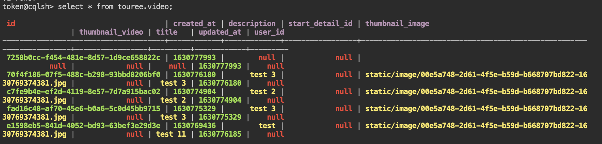

# touree-be

**touree-be** is backend server of toure application.

## API

**touree-be** APIs mainly consisted of video and video detail objects.

### Video

Video in `touree-be` means **video group**. 

#### Get Video
Get video by its video Id. Video Id is UUIDv4 generated.

- GET `/video/:id`
- Query:
	- detail: boolean
- Response:
  ```json
	{
		"status": 0,
		"data": {
			"id": "e1598eb5-841d-4052-bd93-63bef3e29d3e",
			"created_at": "1630769436",
			"description": "test",
			"start_detail_id": null,
			"thumbnail_image": "static/image/00e5a748-2d61-4f5e-b59d-b668707bd822-1630769374381.jpg",
			"thumbnail_video": null,
			"title": "test",
			"updated_at": "1630769436",
			"user_id": null,
			"details": [
				{
					"id": "2c1db448-0f94-4c36-a0cf-baeb0196e06a",
					"video_id": "e1598eb5-841d-4052-bd93-63bef3e29d3e",
					"created_at": "1970-01-19T20:59:30.896Z",
					"default_next_detail_id": null,
					"next_video_details": [
						{
							"shown_text": "test 1",
							"next_detail_id": null
						}
					],
					"prev_detail_id": null,
					"time_to_show_next": "5",
					"updated_at": "1970-01-19T20:59:30.896Z",
					"video_url": null
				}
			]
		}
	}
	```	

#### Create Video
Create new video object and generate new UUIDv4 as id.

- POST `/video`
- Body:
	```json
	{
		"title": "test",
		"description": "test",
		"thumbnail_image": "",
		"thumbnail_video": ""
	}
	```	
- Response:
	```json
	{
		"status": 0,
		"data": {
			"title": "test",
			"description": "test",
			"thumbnail_image": "",
			"thumbnail_video": "",
			"id": "e1598eb5-841d-4052-bd93-63bef3e29d3e",
			"created_at": 1630769436,
			"updated_at": 1630769436
		}
	}
	```

#### Update Video
Update video object based on its id.

- POST `/video/:id`
- Body:
	```json
	{
		"time_to_show_next": 4
	}
	```	
- Response:
	```json
	{
		"status": 0,
		"data": {
			"id": "4dea4a7a-b570-49c9-a617-21ebf298b1c9",
			"created_at": "1630776616",
			"default_next_detail_id": null,
			"next_video_details": [
				{
					"shown_text": "test 1",
					"next_detail_id": null
				}
			],
			"prev_detail_id": null,
			"time_to_show_next": 4,
			"updated_at": 1630776735,
			"video_id": null,
			"video_url": ""
		}
	}
	```

### Video Detail

#### Create Video Detail
Create new video detail object.

- POST `/video_detail`
- Body:
	```json
	{
		"video_id": "e1598eb5-841d-4052-bd93-63bef3e29d3e",
		"time_to_show_next": 5,
		"video_url": "",
		"next_video_details": [
			{
				"shown_text": "test 1"
			}
		]
	}
	```
- Response:
	```json
	{
		"status": 0,
		"data": {
			"video_id": "e1598eb5-841d-4052-bd93-63bef3e29d3e",
			"time_to_show_next": 5,
			"video_url": "",
			"next_video_details": [
				{
					"shown_text": "test 1"
				}
			],
			"id": "4dea4a7a-b570-49c9-a617-21ebf298b1c9",
			"created_at": 1630776616,
			"updated_at": 1630776616
		}
	}
	```

#### Update Video Detail
Update video detail by its id.

- POST `/video_detail/:id`
- Body:
	```json
	{
		"time_to_show_next": 4
	}
	```
- Response:
	```json
	{
		"status": 0,
		"data": {
			"id": "4dea4a7a-b570-49c9-a617-21ebf298b1c9",
			"created_at": "1630776616",
			"default_next_detail_id": null,
			"next_video_details": [
				{
					"shown_text": "test 1",
					"next_detail_id": null
				}
			],
			"prev_detail_id": null,
			"time_to_show_next": 4,
			"updated_at": 1630776735,
			"video_id": null,
			"video_url": ""
		}
	}
	```

#### Delete Video Detail

- DELETE `/video_detail/:id`
- Response:
	```json
	{
		"status": 0,
		"data": "OK"
	}
	```

## DB Cassandra Model

### Video Table
```json
{
	"table": {
		"name": "video",
		"columns": [
			{
				"name": "id",
				"kind": "PARTITION",
				"type": {
					"basic": "UUID"
				}
			},
			{
				"name": "created_at",
				"kind": "REGULAR",
				"type": {
					"basic": "BIGINT"
				}
			},
			{
				"name": "description",
				"kind": "REGULAR",
				"type": {
					"basic": "VARCHAR"
				}
			},
			{
				"name": "start_detail_id",
				"kind": "REGULAR",
				"type": {
					"basic": "UUID"
				}
			},
			{
				"name": "thumbnail_image",
				"kind": "REGULAR",
				"type": {
					"basic": "VARCHAR"
				}
			},
			{
				"name": "thumbnail_video",
				"kind": "REGULAR",
				"type": {
					"basic": "VARCHAR"
				}
			},
			{
				"name": "title",
				"kind": "REGULAR",
				"type": {
					"basic": "VARCHAR"
				}
			},
			{
				"name": "updated_at",
				"kind": "REGULAR",
				"type": {
					"basic": "BIGINT"
				}
			},
			{
				"name": "user_id",
				"kind": "REGULAR",
				"type": {
					"basic": "UUID"
				}
			}
		]
	}
}
```

### VideoDetail Table
```json
{
	"table": {
		"name": "video_detail",
		"columns": [
			{
				"name": "id",
				"kind": "PARTITION",
				"type": {
					"basic": "UUID"
				}
			},
			{
				"name": "created_at",
				"kind": "REGULAR",
				"type": {
					"basic": "BIGINT"
				}
			},
			{
				"name": "default_next_detail_id",
				"kind": "REGULAR",
				"type": {
					"basic": "UUID"
				}
			},
			{
				"name": "next_video_details",
				"kind": "REGULAR",
				"type": {
					"basic": "LIST"
				}
			},
			{
				"name": "prev_detail_id",
				"kind": "REGULAR",
				"type": {
					"basic": "UUID"
				}
			},
			{
				"name": "time_to_show_next",
				"kind": "REGULAR",
				"type": {
					"basic": "BIGINT"
				}
			},
			{
				"name": "updated_at",
				"kind": "REGULAR",
				"type": {
					"basic": "BIGINT"
				}
			},
			{
				"name": "video_id",
				"kind": "REGULAR",
				"type": {
					"basic": "UUID"
				}
			},
			{
				"name": "video_url",
				"kind": "REGULAR",
				"type": {
					"basic": "VARCHAR"
				}
			}
		]
	}
}
```

### VideoEvent Table
```json
{
	"table": {
		"name": "video_event_tab",
		"columns": [
			{
				"name": "partition_time",
				"kind": "PARTITION",
				"type": {
					"basic": "TIMESTAMP"
				}
			},
			{
				"name": "comment_ts",
				"kind": "REGULAR",
				"type": {
					"basic": "TIMESTAMP"
				}
			},
			{
				"name": "current_video_id",
				"kind": "REGULAR",
				"type": {
					"basic": "VARCHAR"
				}
			},
			{
				"name": "event_id",
				"kind": "REGULAR",
				"type": {
					"basic": "VARCHAR"
				}
			},
			{
				"name": "like_ts",
				"kind": "REGULAR",
				"type": {
					"basic": "TIMESTAMP"
				}
			},
			{
				"name": "pause_ts",
				"kind": "REGULAR",
				"type": {
					"basic": "TIMESTAMP"
				}
			},
			{
				"name": "play_ts",
				"kind": "REGULAR",
				"type": {
					"basic": "TIMESTAMP"
				}
			},
			{
				"name": "previous_video_id",
				"kind": "REGULAR",
				"type": {
					"basic": "VARCHAR"
				}
			},
			{
				"name": "quit_ts",
				"kind": "REGULAR",
				"type": {
					"basic": "TIMESTAMP"
				}
			},
			{
				"name": "resume_ts",
				"kind": "REGULAR",
				"type": {
					"basic": "TIMESTAMP"
				}
			},
			{
				"name": "trace_id",
				"kind": "REGULAR",
				"type": {
					"basic": "VARCHAR"
				}
			},
			{
				"name": "user_id",
				"kind": "REGULAR",
				"type": {
					"basic": "VARCHAR"
				}
			},
			{
				"name": "video_id",
				"kind": "REGULAR",
				"type": {
					"basic": "VARCHAR"
				}
			}
		]
	}
}
```

### NextVideoDetail Type
```json
{
	"type": {
		"name": "NextVideoDetail",
		"fields": [
			{
				"name": "shown_text",
				"type": {
					"basic": "VARCHAR"
				}
			},
			{
				"name": "next_detail_id",
				"type": {
					"basic": "UUID"
				}
			}
		]
	}
}
```

### CQL Example

- 
- 
